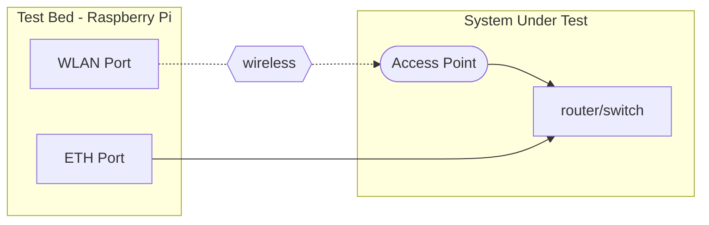
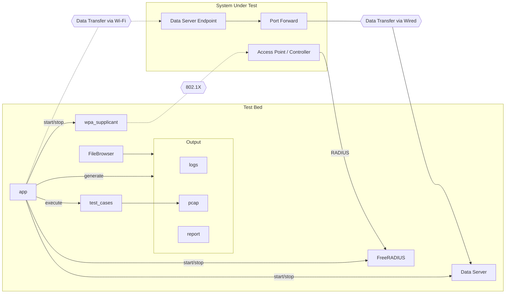

# Self-Certification Test Bed for WBA RADIUS Accounting Assurance Project

This is a self-certification test bed for the WBA RADIUS Accounting Assurance Project.

## Overview

This test bed is designed to run a series of RADIUS tests from a range of categories (see below). The focus of the tests is to verify that the RADIUS-based NAS is compliant with the RADIUS protocol and conforms to best practices. However, the primary goal of this test bed is to verify the usage data reported in accounting is accurate.

This test bed will do the following:

1. Control an end-to-end 802.1X/RADIUS authentication+accounting test, running a packet capture in the process.
2. Get supplicant to transfer a large amount of data.
3. Extract fields from the RADIUS packet capture (PCAP) to run a series of accounting tests. See below for test cases.

## Markers

Markers are used to specify the tests to run against the PCAP. The following markers are currently used:

| Test Category    | Marker | Description |
| -------- | -------- | ------- |
| core | `core` | Basic RADIUS tests for RFC compliance |
| core | `core-upload` | Basic RADIUS tests for file upload |
| core | `core-download` | Basic RADIUS tests for file download |
| openroaming | `openroaming` | OpenRoaming tests |

## Getting Started

### Raspberry Pi Initial Setup

1. Download latest 64-bit Raspberry Pi OS Lite from [here](https://downloads.raspberrypi.com/raspios_lite_arm64/images).
2. Install Raspberry Pi OS Lite from Step 1 and complete out of box setup (see [here](https://www.raspberrypi.org/documentation/installation/installing-images/README.md) for instructions).
3. Clone this repository onto the Raspberry Pi.

```bash
git clone https://github.com/wireless-broadband-alliance/radius-accounting-testbed
```

4. Change directory to radius-accounting-testbed

```bash
cd radius-accounting-testbed
```

5. Run all scripts from `provisioning` folder in order as root user.

```bash
for script in $(find provisioning/ -maxdepth 1 -type f -name "*.sh" | sort); do sudo ./$script; done
```

6. Proceed to Installation section below.

### Installation

Make sure you have the required packages installed (see below). These should already be installed after completing the Getting Started section above.

1. Python3
2. Python virtualenv (optional but recommended)

Navigate to the root directory of this repository and create the Python virtual environment.

```bash
python3 -m venv env
```

Activate the virtual environment:

```bash
source env/bin/activate
```

Install the required packages:

```bash
pip install -r requirements.txt
```

### Starting the Test Bed

#### Via Graphical User Interface (GUI)

This command will start the Streamlit server on port 8080.

```bash
streamlit run app.py --server.port 8080
```

#### Via Command Line Interface (CLI)

This command will start the test bed with default values.
Use the `--help` option to see all available options.

```bash
python appcli.py test <data_server_ip> <data_server_port>
```

Where `data_server_ip` and `data_server_port` are the IP and port to forward traffic through the AP network (System Under Test) to the data server on the Pi.

## System Under Test (SUT)

### Introduction

The Test Bed will run a series of tests against the System Under Test (SUT).
The SUT needs to be an Access Point and a backend network.

### Requirements

The SUT must do the following:

1. Support an 802.1X wireless network. The SSID can be "raatest" but is configurable.
The RADIUS server must be the IP of the wired interface of the test bed.
2. Support a wired network.
3. Provide DHCP access to both wireless and wired clients. A test bed static IP
for wired side may be supported in a future release.
4. Support port forwarding back to test bed. The test bed wireless client will connect to a data server.
The data server IP and port are configurable.

### Test Bed Physical Setup

1. Connect ethernet port on test bed (Raspberry Pi) to a wired port on SUT network and wait for IP.
2. On SUT, broadcast "raatest" or other SSID that belongs to the SUT's 802.1X wireless network.
3. SSH into and start the test bed, see [how to start script](#starting-the-test-bed).
You will need to configure the test bed before executing the test suite(s).

The diagram below shows the required connection to the SUT.



Note: Wireless connection will be made during test execution.

## Test Bed Architecture

### Basic Operation

The Test Bed does the following:

1. Connect to a wireless access point over 802.1X by SSID matching. The access point is part of the System Under Test (SUT).
2. Act as a RADIUS server. The RADIUS client is the SUT and points to the Test Bed.
3. Download or upload data.
4. Execute one or more test suits against a PCAP of RADIUS records that is generated prior to test execution.
5. Generate a test bundle containing test report and data files.

### Diagram

The following diagram shows the operation of the Test Bed.



## Test Cases

### Attribute Checks

#### Core Tests

Purpose is check RFC compliance through attributes.

Markers: `core`, `core-upload`, `core-download`

#### Test Cases for Attribute Checks

1. Unique and persistent Acct-Session-Id in accounting sessions.
2. Acct-Session-Id is persistent in authentication and accounting sessions.
3. Start, Update, and Stop records are present in accounting session.
4. One Start and Stop record (two Stops reporting different values?).
5. Stop record is last message in accounting session
6. Stop record contains highest usage fields.
7. At least 3 Class attributes are echoed.
8. Persistent CUI is echoed.
9. Acct-Input-Gigaword rolls over.
10. Acct-Output-Gigaword rolls over.

### Accuracy Checks

Purpose is to verify reported attribute values are accurate.

#### Test Cases for Accuracy Checks

1. Input tonnage is accurate.
2. Output tonnage is accurate.
3. Session duration is accurate.
4. Input packet count is non-zero.
5. Output packet count is non-zero.

## Help Option

### Usage

Use the `--help` option to see all available options when using command line.

```bash
python3 appcli.py --help
```

### All Possible Options

There are several options available to the user. The following is the help output:

```bash
usage: appcli.py [-h] [--config CONFIG] [--markers MARKERS] [--debug] [--data_server_listen_port DATA_SERVER_LISTEN_PORT]
                 [--local_output_dir LOCAL_OUTPUT_DIR] [--chunk_size CHUNK_SIZE] [--chunks CHUNKS] [--ssid SSID] [--sut_software SUT_SOFTWARE]
                 [--sut_brand SUT_BRAND] [--sut_hardware SUT_HARDWARE] [--client_iface CLIENT_IFACE] [--server_iface SERVER_IFACE] [--no_pcap]
                 [--no_test] [--no_upload] [--no_download]
                 test_name data_server_ip data_server_port

positional arguments:
  test_name             Name of the test to run
  data_server_ip        IP of the data server for uploading and downloading
  data_server_port      Port of the data server for uploading and downloading

options:
  -h, --help            show this help message and exit
  --config CONFIG       Optional config file to get input from
  --markers MARKERS     Test Markers: core, core_upload, core_download, openroaming
  --debug
  --data_server_listen_port DATA_SERVER_LISTEN_PORT
                        default: 8000
  --local_output_dir LOCAL_OUTPUT_DIR
                        default: /usr/local/raa
  --chunk_size CHUNK_SIZE
                        default: 1024
  --chunks CHUNKS       Number of chunks to pull, default: 10
  --ssid SSID           default: raatest
  --sut_software SUT_SOFTWARE
                        Software info for System Under Test (SUT)
  --sut_brand SUT_BRAND
                        Brand of System Under Test (SUT)
  --sut_hardware SUT_HARDWARE
                        Hardware info for System Under Test (SUT)
  --client_iface CLIENT_IFACE
                        default: wlan0
  --server_iface SERVER_IFACE
                        default: eth0
  --no_pcap             Skip PCAP generation
  --no_test             Skip test case execution
  --no_upload           Do not upload chunks
  --no_download         Do not download chunks
```
