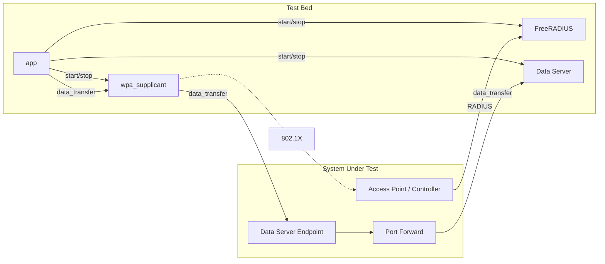

# Self-Certification Test Bed for WBA RADIUS Accounting Assurance Project

This is a self-certification test bed for the WBA RADIUS Accounting Assurance Project.

## Overview

This test bed is designed to run a series of RADIUS tests from a range of categories (see below). The focus of the tests is to verify that the RADIUS-based NAS is compliant with the RADIUS protocol and conforms to best practices. However, the primary goal of this test bed is to verify the usage data reported in accounting is accurate.

## Basic Operation

This test bed will do the following:

1. Control an end-to-end 802.1X/RADIUS authentication+accounting test, running a packet capture in the process.
2. Get supplicant to transfer a large amount of data.
3. Extract fields from the RADIUS packet capture (PCAP) to run a series of accounting tests. See below for test cases.

## Markers

Markers are used to specify the tests to run against the PCAP. The following markers are currently used:

| Test Category    | Marker | Description |
| -------- | -------- | ------- |
| core | `core` | Basic RADIUS tests for RFC compliance |
| core | `core-upload` | Basic RADIUS tests for file upload |
| core | `core-download` | Basic RADIUS tests for file download |
| openroaming | `openroaming` | OpenRoaming tests |

## Getting Started

### Raspberry Pi Initial Setup

1. Download latest 64-bit Raspberry Pi OS Lite from [here](https://downloads.raspberrypi.com/raspios_lite_arm64/images).
2. Install Raspberry Pi OS Lite from Step 1 and complete out of box setup (see [here](https://www.raspberrypi.org/documentation/installation/installing-images/README.md) for instructions).
3. Clone this repository onto Raspberry Pi.

```bash
git clone https://github.com/wireless-broadband-alliance/radius-accounting-testbed
```

4. Run all scripts from `provisioning` folder in order as root user.

```bash
for script in $(find provisioning/ -maxdepth 1 -type f -name "*.sh" | sort); sudo ./$script
```

5. Proceed to Installation section below.

### Installation

Make sure you have the required packages installed (see below). These should already be installed after completing the Getting Started section above.

1. Python3
2. Python virtualenv (optional but recommended)

Clone this repository and navigate to the root directory.

Create the virtual environment:

```bash
python3 -m venv env
```

Activate the virtual environment:

```bash
source env/bin/activate
```

Install the required packages:

```bash
pip install -r requirements.txt
```

### Starting the Test Bed

#### Via Graphical User Interface (GUI)

This command will start the Streamlit server on port 8080.

```bash
streamlit run app.py --server.port 8080
```

#### Via Command Line Interface (CLI)

This command will start the test bed with default values.
Use the `--help` option to see all available options.

```bash
python appcli.py test <data_server_ip> <data_server_port>
```

Where `data_server_ip` and `data_server_port` are the IP and port to forward traffic through the AP network (System Under Test) to the data server on the Pi.

## Test Bed Architecture
### Basic Operation
The test bed does the following:
1. Connect to a wireless access point over 802.1X by SSID matching. The access point is part of the System Under Test (SUT).
2. Act as a RADIUS server. The RADIUS client is the SUT and points to the test bed.
3. Download or upload data.
4. Generate and run a series of tests against the PCAP.
5. Generate a test bundle containing test report and data files.



## Test Cases

### Attribute Checks

#### Core Tests

Purpose is check RFC compliance through attributes.

Markers: `core`, `core-upload`, `core-download`

#### Test Cases for Attribute Checks

1. Unique and persistent Acct-Session-Id in accounting sessions.
2. Acct-Session-Id is persistent in authentication and accounting sessions.
3. Start, Update, and Stop records are present in accounting session.
4. One Start and Stop record (two Stops reporting different values?).
5. Stop record is last message in accounting session
6. Stop record contains highest usage fields.
7. At least 3 Class attributes are echoed.
8. Persistent CUI is echoed.
9. Acct-Input-Gigaword rolls over.
10. Acct-Output-Gigaword rolls over.

### Accuracy Checks

Purpose is to verify reported attribute values are accurate.

#### Test Cases for Accuracy Checks

1. Input tonnage is accurate.
2. Output tonnage is accurate.
3. Session duration is accurate.
4. Input packet count is non-zero.
5. Output packet count is non-zero.

### Run Demo

### Help

Use the `--help` option to see all available options.

```bash
python3 appcli.py --help
```

### All Possible Options

There are several options available to the user. The following is the help output:

```bash
usage: appcli.py [-h] [--markers MARKERS] [--interface INTERFACE] [--debug] [--data_server_listen_port DATA_SERVER_LISTEN_PORT] [--root_dir ROOT_DIR] [--chunk_size CHUNK_SIZE]
                 [--chunks CHUNKS] [--ssid SSID] [--sut_firmware SUT_FIRMWARE] [--sut_make SUT_MAKE] [--sut_model SUT_MODEL] [--wireless_interface WIRELESS_INTERFACE]
                 [--wired_interface WIRED_INTERFACE] [--no_pcap] [--no_test]
                 test_name data_server_ip data_server_port

positional arguments:
  test_name             Name of the test to run
  data_server_ip        IP of the server to get data from
  data_server_port      Port of the server to get data from

options:
  -h, --help            show this help message and exit
  --markers MARKERS     Test Markers: core, core-upload, core-download, openroaming (default)
  --interface INTERFACE
                        Interface used to get data from (default: wlan0)
  --debug
  --data_server_listen_port DATA_SERVER_LISTEN_PORT
                        default: 8000
  --root_dir ROOT_DIR   default: /usr/local/raa
  --chunk_size CHUNK_SIZE
                        default: 1048576
  --chunks CHUNKS       Number of chunks to pull, default: 1
  --ssid SSID           default: raatest
  --sut_firmware SUT_FIRMWARE
                        SUT firmware
  --sut_make SUT_MAKE   SUT make
  --sut_model SUT_MODEL
                        SUT model
  --wireless_interface WIRELESS_INTERFACE
                        default: wlan0
  --wired_interface WIRED_INTERFACE
                        default: eth0
  --no_pcap             Skip PCAP generation
  --no_test             Skip test case execution
```
